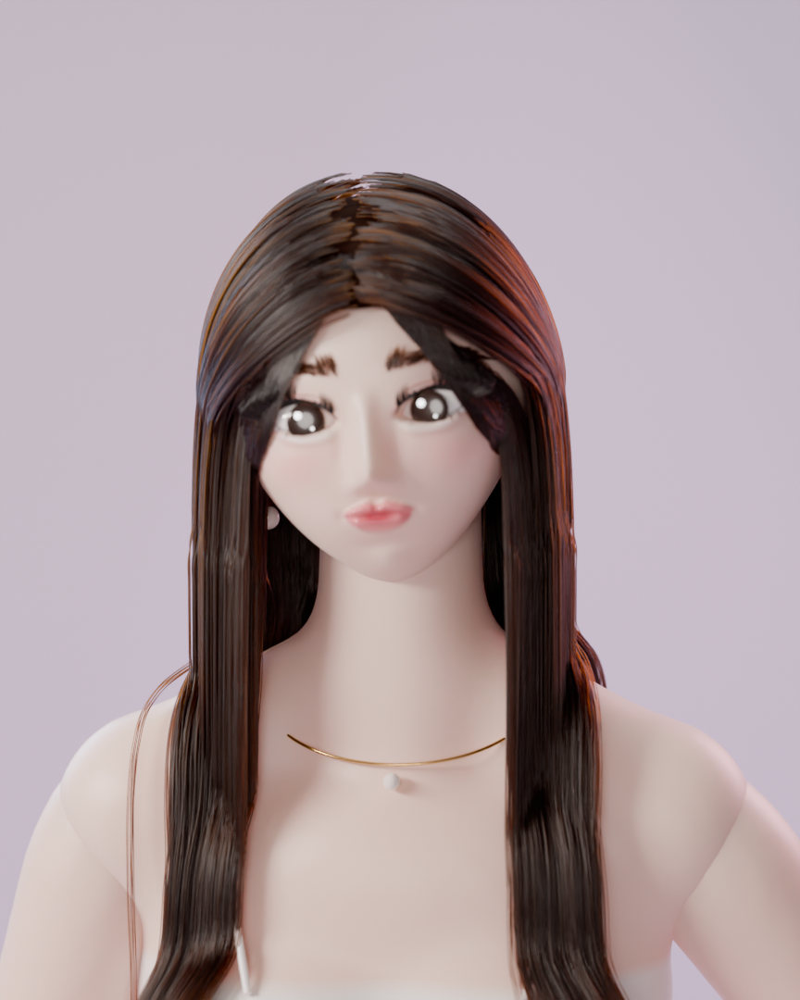
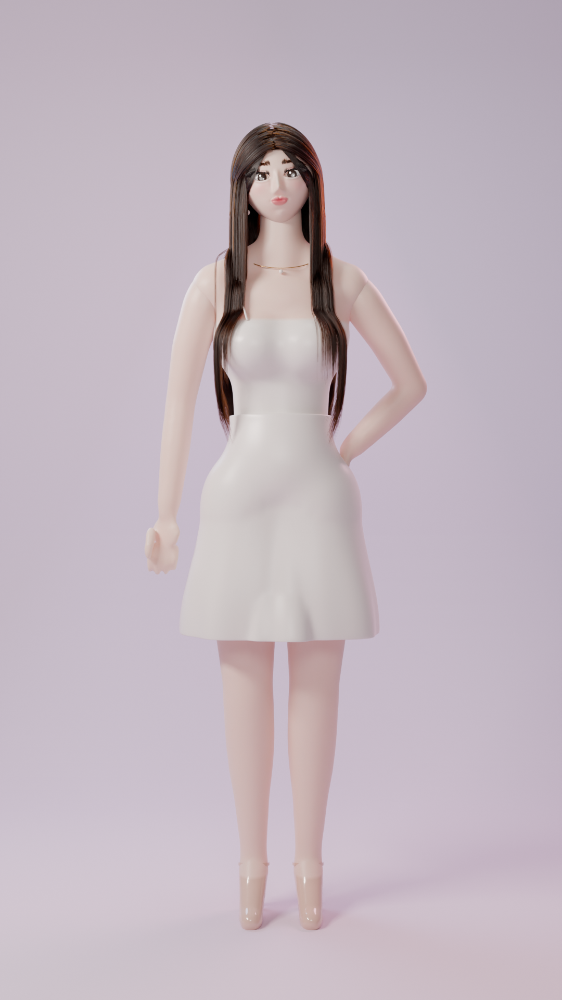
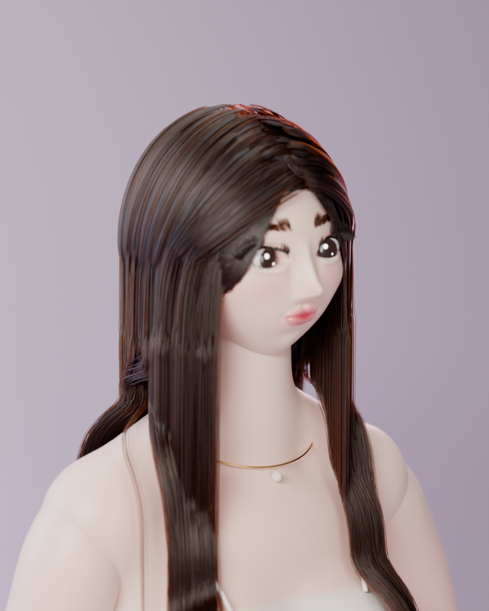

# 抖音网红风 美女角色建模 (Blender)

`douyin_girl.py` 用纯 Python 脚本在 Blender 中**程序化生成**一个符合抖音网红审美的风格化美女角色，并配好环形补光灯 + 粉紫色背景的竖屏 (9:16) 拍摄场景。

| 半身特写 | 全身 (9:16) | 3/4 侧脸 |
| --- | --- | --- |
|  |  |  |

## 审美要点 → 建模实现

| 抖音审美 | 实现方式 |
| --- | --- |
| 小 V 脸、尖下巴、短中庭 | 四边形球体顶点变形：超椭圆面部 + 下颌锥形收窄 |
| 大眼、双眼皮、卧蚕 | 杏仁形眼眶雕刻、双眼皮褶线、眼下卧蚕凸起与高光 |
| 美瞳 + 眼神光 | 程序化虹膜材质（浅棕色放射纹理 + 深色外圈）、发光高光点 |
| 漫画睫毛、小眼线 | 成簇上睫毛、尖簇下睫毛、上扬眼线 |
| 野生平眉 | 300 根短毛发 + 底层眉粉 |
| 高鼻梁、小翘鼻 | 鼻梁脊线 + 鼻头 + 鼻翼高斯凸起 |
| 咬唇妆、水光唇 | 顶点色渐变唇色 + 唇部低粗糙度/清漆层 |
| 冷白皮、腮红、鼻尖晒伤妆 | 次表面散射皮肤 + 顶点色绘制腮红、眼影、高光 |
| 茶棕色长直发、八字刘海、中分 | 引导发丝 + 子发丝插值（约 2 万根原生毛发曲线），带身体碰撞 |
| 天鹅颈、直角肩、细腰、长腿 | Metaball 人体，转换为网格并平滑 |
| 歪头、叉腰 Pose | 头部绕颈部倾斜 6°，单手叉腰 |
| 白色吊带裙、裸色高跟、珍珠耳环、锁骨链 | 贴身 + 下摆外扩的缎面裙摆、细吊带、配饰 |
| 环形补光灯、马卡龙背景 | 正面圆形面光（眼中圆形高光）+ 粉/蓝轮廓光、渐变无缝背景 |

## 使用方法

**在 Blender (4.2+ / 5.x) 中：** 打开 *Scripting* 工作区 → 打开 `douyin_girl.py` → *Run Script*。场景会被清空并重新生成；相机 `Cam_Portrait`、`Cam_Full`、`Cam_ThreeQuarter` 已经摆好，渲染引擎为 Cycles。

**命令行（无界面）：**

```bash
blender --background --python douyin_girl.py -- --render          # 生成 .blend 并渲染三张图
blender --background --python douyin_girl.py -- --render --quick  # 低精度快速预览
blender --background --python douyin_girl.py -- --render --only portrait --out ./out
```

也可以用 pip 版的 `bpy`：`pip install bpy` 后直接 `python douyin_girl.py --render`。

参数：

- `--render` 渲染（否则只生成并保存 `douyin_girl.blend`）
- `--quick` 降低网格、毛发数量和采样，用于快速预览
- `--only portrait,full,side,profile` 只渲染指定镜头（`profile` 为纯侧面调试镜头）
- `--out DIR` 输出目录（默认是脚本所在目录）

## 调整外观

主要参数都在脚本顶部附近，改完重新运行即可：

- 肤色 / 妆容：`SKIN`、`BLUSH`、`LIP_IN`、`LIP_OUT`、`SHADOW_EYE`
- 眼睛大小与形状：`EYE_A`（眼宽）、`EYE_HU` / `EYE_HL`（上/下眼睑高度）、`EYE_LIFT`（眼尾上扬）
- 美瞳颜色：`mat_iris()` 中的色带
- 发色：`build_hair()` 中 `mat_hair(..., melanin=..., redness=...)`
- 裙长：`DRESS_HEM`
